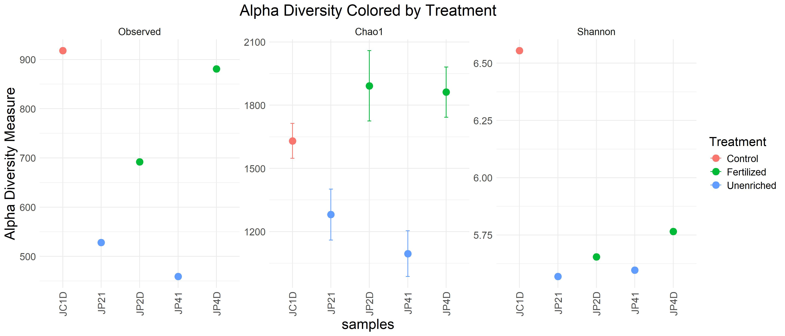
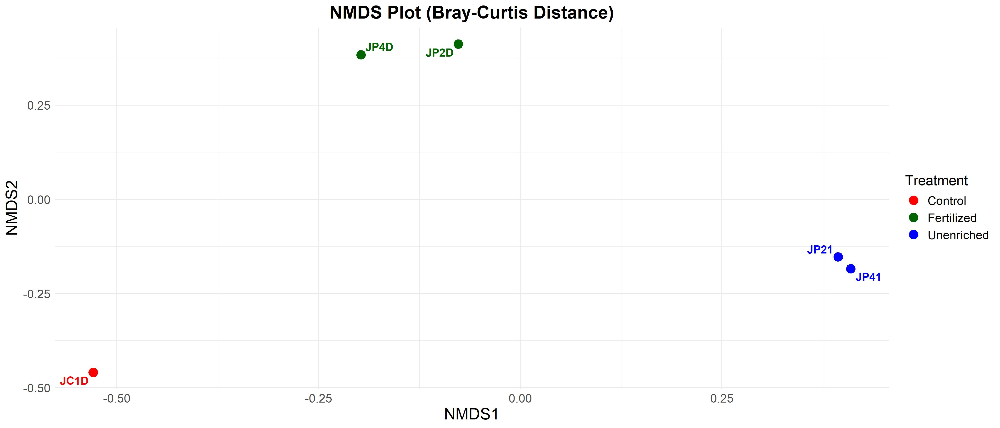

# Metagenomic Analysis of Environmental Samples

Welcome to the project page for analyzing metagenomic samples using 16S sequencing data. This project focuses on exploring microbial diversity and taxonomy using a custom bioinformatics pipeline. Below, is a detailed overview of the workflow, including preprocessing steps, diversity analysis, and visualization of results.

### Objective

This project is carried out with the aim to reporoduce previously published article by [Okie et al, 2020](https://elifesciences.org/articles/49816), which is summarized below. Here, I am reporoducing the project just for learning purpose. Although original paper have used 40 samples together, I have used only 6 samples considering computational limitation. The original data is available as [Bioproject PRJEB22811​](https://www.ncbi.nlm.nih.gov/bioproject?Db=biosample&DbFrom=bioproject&Cmd=Link&LinkName=bioproject_biosample&LinkReadableName=BioSample&ordinalpos=1&IdsFromResult=420272)

### Summary of the original work:

[This paper](https://elifesciences.org/articles/49816) investigates how genomic traits mediate microbial community responses to nutrient enrichment in an oligotrophic, phosphorus-deficient pond in Mexico. By analyzing metagenomic data, the study demonstrates that fertilized environments lead to increased bacterial genome size, GC content, tRNA and rRNA gene counts, and codon usage bias, favoring traits that support higher growth rates and metabolic capacities. This work underscores the value of integrating genomic and ecological data for understanding microbial ecosystems.

### Project Workflow

0. Setup

The project started with creating a new conda environment and installing all required dependencies, the codes for which are [available in this file](scripts/setup.md)

1. Data Preprocessing [see more](scripts/data_preprocessing.md)

The preprocessing phase ensures the raw 16S rRNA sequencing data is cleaned, assembled, and prepared for downstream analyses.

Key Steps:

- Directory Structure Setup: Organized directories for [data](data/), [results](results/), [scripts](scripts/), and [metadata](metadata/).

- Downloading FASTQ Files: Retrieved raw sequencing data using [download links](data/wget_links.txt)

- Quality Assessment: Performed initial quality checks using FastQC.

- Trimming: Cleaned low-quality bases and adapter sequences using Trimmomatic.

- Re-evaluation: Verified trimmed reads for quality assurance with FastQC.

- Assembly: Generated contigs and scaffolds using MetaSPAdes for each sample.

- Binning: Grouped assembled contigs into bins representing individual genomes using MaxBin.

*Please note that all intermediate files are not uploaded in github repo, because of the size limitations*

Outputs:

Quality reports are available in the results/initial_fastqc_reports and results/post_trimming_fastqc_reports directories.

Contigs and scaffolds are stored in the data/working_data/assembled_files/ directory.

Binned genomic data is saved in data/working_data/binned_files/
Summary of the binning can be obtained from [here](results/summary_binning/)

2. Taxonomic Analysis

Taxonomic classification provides insights into the microbial composition within the samples.

Key Steps:

Taxonomic Assignment: Performed using Kraken2 against Kraken2 database. See 

Visualization: Created taxonomy visualizations with Krona. [HTML files available here](data/working_data/krona_files/)

3. Diversity Analysis

The diversity analysis investigates the richness and evenness of microbial communities.

*Alpha Diversity*:

Control samples tend to have higher observed richness and diversity, indicating a potentially stable and diverse microbial community.

Fertilized samples show moderately high diversity, likely reflecting enhanced nutrient availability.

Unenriched samples have the lowest diversity, which could be due to nutrient limitation or other stress factors.

*Beta Diversity*:

*Absolute abundance matrix*:

*Relative abundance matrix*:

Outputs:

Diversity analysis plots are available in the [results folder](results/) for further exploration and reporting.

All processed and summarized data culminates in a [final.biom file](data/working_data/tx_files/final.biom), a JSON-formatted BIOM file, which serves as a compact representation of microbial profiles.

### Tools and Technologies

This project utilizes the following bioinformatics tools and pipelines:

- FastQC: For quality assessment.
- Trimmomatic: For trimming low-quality reads.
- MetaSPAdes: For metagenomic assembly.
- MaxBin: For metagenomic binning.
- Kraken2: For taxonomic assignment.
- Krona: For interactive visualizations.
- Kraken-BIOM: For creating BIOM files.

**Please check [this github repo](https://github.com/poudelmohit/env-metagenomics-analysis) for details**

## Special Thanks:

[**Alavarado-Serrano Lab, Ohio Univesity**](https://alvarado-s.weebly.com)

## Additional Resources:
paper to follow: https://elifesciences.org/articles/49816

data available at: https://zenodo.org/records/7010950
